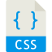

# Project "Portfolio with Bootstrap 4"

## About
1. This was an exercise from **DCI's WEB Development Course**, which I attended between 2019 - 2021. 
2. We had 2 days to deliver the maximal we could.

#### The mainly tasks were: 
- [x] Build your **Portfolio** using Bootstrap and SASS;
- [x] Use **Sass** for this build;
- [x] Deploy

### 🚀 Technologies used

